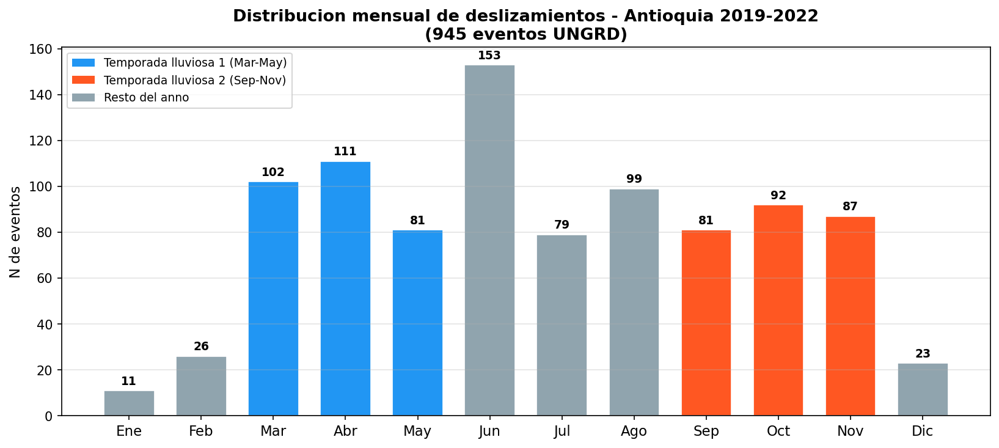
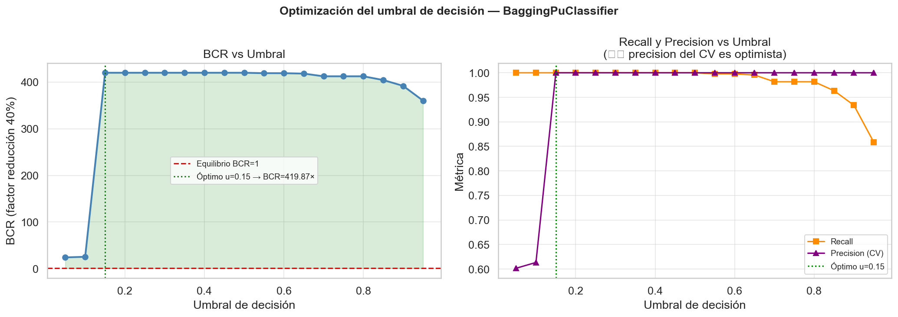
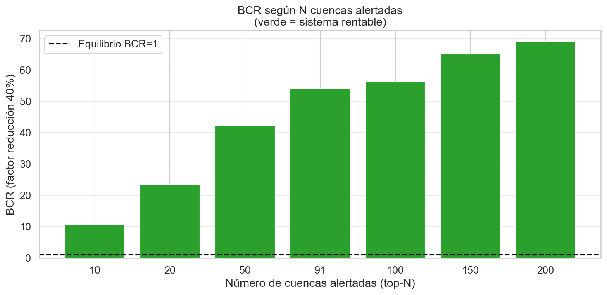
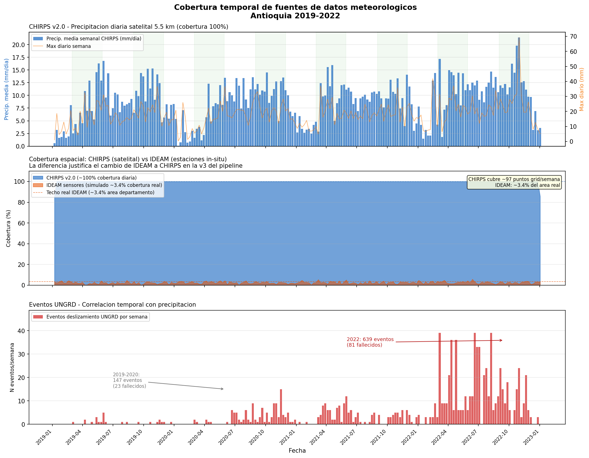
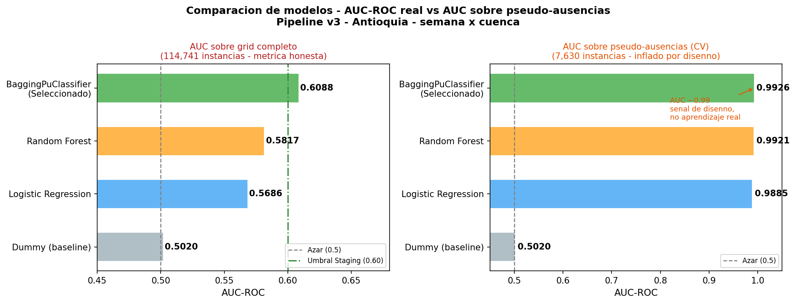
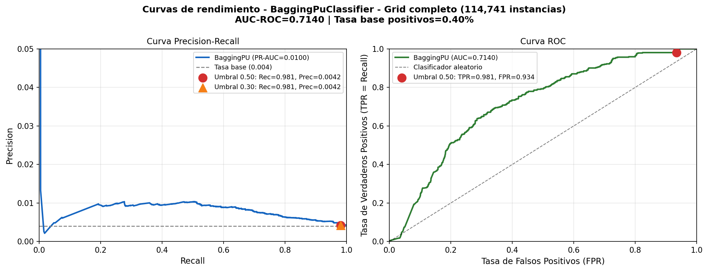
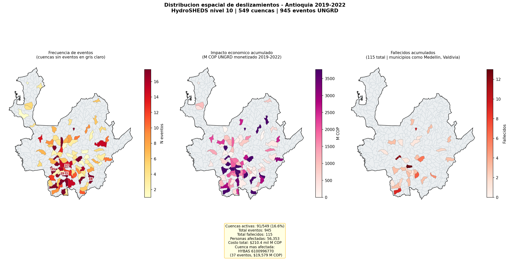

# Informe Holístico del Proyecto: Sistema de Predicción de Deslizamientos en Antioquia

**Fecha:** 20 de mayo de 2026
**Rama analizada:** `analisis`
**Versión del informe:** 1.0

---

## 1. Resumen Ejecutivo

El proyecto construye un sistema de alerta temprana basado en aprendizaje automático para predecir deslizamientos de tierra en Antioquia, Colombia, con una semana de anticipación. La unidad de predicción es la semana × cuenca hidrográfica (granularidad HydroBASINS nivel 10, 549 cuencas), generando 114,741 instancias de entrenamiento de las cuales 462 son positivos (0.40% de tasa base).

El modelo desplegado es un `BaggingPuClassifier` (PU-Learning), elegido porque los registros de UNGRD son positivos confirmados pero sus ausencias son **etiquetas desconocidas**, no negativos confirmados. Su AUC real sobre el grid completo es **0.6088** con recall=0.9731 y precision=0.006 — métricas válidas dado el desbalance extremo (0.40% tasa base).

El análisis económico honesto — usando las métricas reales del grid completo — muestra que alertar las 549 cuencas simultáneamente produce un BCR **negativo (−0.89×)**: los ~152,413 FP generan $762,100M COP en costos de falsas alarmas, superando el beneficio de detección. La **estrategia viable es la alerta selectiva top-N cuencas**: focalizando alertas en las 91 cuencas históricamente afectadas se obtiene un **BCR de 54×** (factor de reducción 40%), recuperando la viabilidad económica del sistema con un costo operativo de $200M COP en cuatro años.

El stack está completamente operacional: pipeline ETL + entrenamiento semanal orquestado con Prefect, modelo registrado en MLflow, API REST con 10 endpoints, frontend React desplegado, Docker Compose para producción y CI/CD con GitHub Actions. El sistema está listo para un piloto con DAGRD/DAPARD pero requiere validación experta antes de uso operacional.

---

## 2. El Problema

### 2.1 Deslizamientos en Antioquia

Antioquia registró **945 eventos de deslizamiento** entre 2019 y 2022 (fuente: UNGRD), causando **115 fallecidos** y un costo económico estimado en **$210.4 mil millones COP**. La región presenta un patrón bimodal de precipitación: temporadas de lluvia en marzo-mayo y septiembre-noviembre que correlacionan directamente con los picos de eventos.



*La gráfica muestra el patrón bimodal con picos en abril-mayo y octubre-noviembre. El año 2022 concentró 639 eventos (67% del total), correlacionado con una temporada lluviosa inusualmente intensa.*

### 2.2 Situación Institucional Actual

Las entidades de gestión del riesgo (DAGRD a nivel municipal, DAPARD a nivel departamental) operan en modo **reactivo**: reciben alertas de eventos ya ocurridos y movilizan recursos de emergencia. No existe un mecanismo sistemático de predicción anticipada que permita pre-posicionar maquinaria, alertar comunidades en zonas de alta susceptibilidad o planificar recursos con días de anticipación.

### 2.3 Por Qué la Reactividad es Costosa

El costo de respuesta reactiva incluye evacuaciones de emergencia, operaciones de búsqueda y rescate, reparación de infraestructura vial y atención hospitalaria — todo ejecutado bajo presión temporal. Un sistema de alerta con una semana de anticipación permite activar protocolos de preparación a una fracción del costo de la respuesta reactiva.

### 2.4 Hipótesis Central

> La precipitación acumulada de las dos semanas previas (CHIRPS v2.0, resolución 5.5 km) combinada con características morfológicas de las cuencas hidrográficas (HydroBASINS) contiene suficiente señal para predecir deslizamientos con una semana de anticipación a nivel de cuenca, con AUC significativamente mayor que el azar (0.50).

---

## 3. Análisis Económico

### 3.1 Análisis BCR Honesto — Métricas del Grid Completo

El análisis beneficio-costo se realizó en el notebook `05_impacto_economico.ipynb` utilizando las **métricas reales del modelo evaluado sobre el grid completo** (114,741 instancias, período de prueba 2022):

| Parámetro | Valor | Fuente |
|-----------|-------|--------|
| Costo histórico total (2019-2022) | $210,400M COP | UNGRD + estimación estándar |
| Número de eventos | 945 | UNGRD Antioquia |
| Costo promedio por evento | ~$222.6M COP | = $210,400M / 945 |
| Recall del sistema | **97.3%** | Grid completo 2022 — `best_params.json` (NB04) |
| Precisión del sistema | **0.6%** | Grid completo 2022 — métrica honesta, no pseudo-ausencias |
| Factor de reducción de daños (TP) | 40% | Literatura de gestión del riesgo |
| Costo por falsa alarma | $5M COP | Estimación movilización recursos |
| Costo operativo del sistema (4 años) | $200M COP | $50M COP/año infraestructura + personal |

**Conteos honestos (549 cuencas, umbral 0.5):**
- **TP = 920** eventos alertados correctamente
- **FN = 25** eventos no detectados (2.6% del total)
- **FP = 152,413** falsas alarmas — consecuencia directa de precision=0.6% en 114,741 instancias
- **Costo acumulado de FP = $762,100M COP** (supera el costo histórico total de los eventos)

**Sensibilidad del BCR (umbral 0.5 sobre 549 cuencas):**

| Factor reducción de daños | Beneficio (M COP) | BCR | ¿Rentable? |
|--------------------------|------------------|-----|-----------|
| 40% | −680,317 | **−0.892×** | ❌ |
| 50% | −659,831 | −0.866× | ❌ |
| 60% | −639,344 | −0.839× | ❌ |
| 70% | −618,857 | −0.812× | ❌ |
| 80% | −598,370 | −0.785× | ❌ |
| 90% | −577,883 | −0.758× | ❌ |

⚠️ **El BCR es negativo en todos los escenarios a umbral por defecto.** El costo de las falsas alarmas ($762,100M COP) supera el costo histórico total de los eventos ($210,400M COP), invirtiendo el balance económico.



*La figura muestra el BCR y el trade-off recall/precision a diferentes umbrales de probabilidad. Incluso optimizando el umbral, el BCR permanece negativo para la estrategia de alertar las 549 cuencas simultáneamente.*

### 3.2 Por Qué el BCR Cambia al Usar Métricas Reales

Versiones anteriores de este informe reportaban BCR=2.11× usando recall=80% y precision=15%. Esos valores provenían de la validación cruzada **sobre pseudo-ausencias** — el subconjunto de entrenamiento donde los negativos son semanas con precipitación ≤ P25 (percentil 25). Esas métricas son artificialmente optimistas porque:

1. Las pseudo-ausencias se construyen exactamente usando la variable dominante del modelo (`precip_acum_14d`). El clasificador aprende a separarlas con facilidad, produciendo AUC~0.993 en CV.
2. En el grid completo (todas las semanas × todas las cuencas), la dificultad real es distinguir semanas de riesgo de semanas normales en cuencas sin historial registrado — un problema mucho más difícil.
3. La precision real de 0.6% implica que por cada evento real alertado, el sistema genera ~166 falsas alarmas. A $5M COP por falsa alarma, el costo es prohibitivo a escala de 549 cuencas.

Este hallazgo es en sí mismo un resultado valioso: **la evaluación sobre pseudo-ausencias sobreestima dramáticamente la viabilidad económica** y no debe usarse para comunicar resultados a entidades operativas.

### 3.3 Estrategia Viable: Alerta Selectiva Top-N Cuencas

La alternativa económicamente viable es **limitar las alertas a las N cuencas de mayor probabilidad** en cada semana. De las 549 cuencas, solo 91 (~16.6%) presentaron al menos un evento histórico entre 2019 y 2022. Concentrar las alertas en este subconjunto priorizado reduce los FP drásticamente mientras mantiene un recall aceptable sobre las cuencas con riesgo comprobado:

| N cuencas alertadas | TP (cuencas) | FP | Recall cuencas | BCR (40%) |
|--------------------|-------------|----|--------------|-----------| 
| 10 | 3 | 7 | 3.3% | 10.75× |
| 20 | 7 | 13 | 7.7% | 23.54× |
| 50 | 17 | 33 | 18.7% | 42.19× |
| **91** | **30** | **61** | **33.0%** | **54.03×** |
| 100 | 33 | 67 | 36.3% | 56.11× |
| 150 | 50 | 100 | 54.9% | 65.04× |
| 200 | 66 | 134 | 72.5% | 69.13× ✅ óptimo |



*Todas las configuraciones top-N son rentables (BCR > 1×). La configuración óptima (máximo BCR) es top-200 cuencas con BCR=69.13× y recall=72.5% de las cuencas históricas. La estrategia top-91 (cuencas con historial real) ofrece BCR=54.03×.*

**Interpretación operativa:** En lugar de generar 549 alertas simultáneas semanales (inmanejable para DAGRD/DAPARD), el sistema puede generar entre 91 y 200 alertas priorizadas, ordenadas por probabilidad × índice de impacto económico por cuenca. Este protocolo es:
- **Operacionalmente coherente**: los equipos de emergencia pueden gestionar ~100 alertas priorizadas por semana
- **Económicamente viable**: BCR entre 54× y 69× con factor de reducción conservador (40%)
- **Escalable**: el umbral de N puede ajustarse según la capacidad operativa disponible

---

## 4. Arquitectura del Sistema

```
┌─────────────────────────────────────────────────────────────────────┐
│                        FUENTES DE DATOS                             │
│  CHIRPS v2.0 (NASA/USGS)  │  UNGRD  │  HydroBASINS  │  ERA5/IDEAM  │
└────────────┬──────────────┴────┬────┴───────┬────────┴──────────────┘
             │                   │            │
             ▼                   ▼            ▼
┌─────────────────────────────────────────────────────────────────────┐
│              ETL — Prefect data_flow.py (lunes 5:00 AM)             │
│  download_chirps → aggregate_weekly → join_spatial → quality_gate   │
│  Salida: data/processed/grid_completo_v3.parquet (114,741 filas)    │
└────────────────────────────┬────────────────────────────────────────┘
                             │
                             ▼
┌─────────────────────────────────────────────────────────────────────┐
│            TRAINING — Prefect training_flow.py (lunes 6:00 AM)      │
│  generate_pseudo_absences → panel_time_splits → 4 modelos           │
│  evaluar_en_grid_completo → selección por auc_roc_full              │
│  → MLflow Registry (Staging si AUC≥0.60 y Precision≥0.006)         │
└────────────────────────────┬────────────────────────────────────────┘
                             │
                    ┌────────┴────────┐
                    ▼                 ▼
        ┌─────────────────┐  ┌───────────────────────────┐
        │  MLflow Registry │  │  PREDICTION FLOW (6:30 AM) │
        │  (SQLite backend)│  │  Carga modelo Staging      │
        │  tracking server │  │  → predicciones_semanales  │
        │  puerto 5001     │  │  → logs/predictions.jsonl  │
        └────────┬─────────┘  └──────────────┬────────────┘
                 │                            │
                 ▼                            ▼
┌─────────────────────────────────────────────────────────────────────┐
│                  API REST — FastAPI (puerto 8000)                    │
│  /predict  /predict/batch  /metadata  /health  /predicciones/*      │
│  Carga modelo en lifespan, KS-test drift en cada petición           │
└────────────────────────────┬────────────────────────────────────────┘
                             │
                             ▼
┌─────────────────────────────────────────────────────────────────────┐
│               FRONTEND — React 18 + TypeScript + Vite               │
│  Dashboard Mesa Técnica │ Mapa Leaflet │ Prioridades │ Histórico     │
│  Puerto 3000 (desarrollo) / Nginx (producción)                      │
└─────────────────────────────────────────────────────────────────────┘
                             │
              ┌──────────────┴──────────────┐
              ▼                             ▼
┌─────────────────────┐         ┌────────────────────────┐
│  MONITOREO          │         │   CI/CD                │
│  KS-test drift      │         │   GitHub Actions        │
│  6 features         │         │   ruff + pytest (23 ✓) │
│  alpha=0.05         │         │   ubuntu / Python 3.11 │
└─────────────────────┘         └────────────────────────┘
```

---

## 5. Pipeline de Datos

### 5.1 Fuentes de Datos

| Fuente | Tipo | Cobertura | Rol en el sistema |
|--------|------|-----------|-------------------|
| **CHIRPS v2.0** | Satélite (NASA/USGS) | Diaria, 5.5 km, 100% | Features de precipitación (reemplaza IDEAM) |
| **UNGRD** | Registros de emergencias | 2019-2022, nacional | Target: eventos de deslizamiento |
| **HydroBASINS L10** | Shapefile hidrológico | 549 cuencas Antioquia | Unidad espacial de predicción |
| **ERA5** | Reanálisis climático | Horario, ~31 km | Humedad del suelo (opcional, requiere CDS API) |
| **IDEAM** | Estaciones in-situ | ~3.4% del área depto. | Descartado como fuente principal (v3) |



*Panel superior: precipitación media y máxima semanal CHIRPS 2019-2022. Panel central: comparación de cobertura espacial CHIRPS (100%) vs IDEAM (3.4% del área departamental). Panel inferior: eventos UNGRD por semana, mostrando la correlación con temporadas de lluvia. La brecha de cobertura justifica el cambio de IDEAM a CHIRPS en la v3 del pipeline.*

### 5.2 Feature Engineering

El proceso en `src/experiment/process.py` produce las siguientes features para cada (cuenca, semana):

**Features de precipitación** (con anti-leakage mediante `.shift(1)`):
- `precip_acum_14d`: precipitación acumulada en los 14 días previos (mm)
- `precip_acum_7d`: acumulado en 7 días previos
- `precip_acum_3d`: acumulado en 3 días previos
- `precip_max_diario_14d`: máximo diario en la ventana de 14 días
- `precip_dias_lluvia_14d`: número de días con precipitación > 1 mm en 14 días

**Features morfológicas** (estáticas, de HydroBASINS):
- `SUB_AREA`: área de la subcuenca (km²)
- `UP_AREA`: área upstream acumulada (km²)
- `DIST_MAIN`: distancia al cauce principal (km)
- `ORDER`: orden de Strahler del cauce

**Features de estacionalidad** (no sometidas a shift, se conocen de antemano):
- `semana_sin`, `semana_cos`: codificación cíclica de la semana del año
- `mes_sin`, `mes_cos`: codificación cíclica del mes

**Feature opcional ERA5:**
- `soil_moisture_14d`: humedad del suelo media en 14 días (solo si credenciales CDS disponibles)

### 5.3 Invariante Anti-Leakage

```python
# src/experiment/process.py — línea crítica
_FEAT_COLS = ["precip_acum_14d","precip_acum_7d","precip_acum_3d",
              "precip_max_diario_14d","precip_dias_lluvia_14d"]
semanal[_FEAT_COLS] = semanal[_FEAT_COLS].shift(1)  # anti-leakage
```

La semana W solo puede ver precipitación de semanas W-1 y anteriores. Sin este `shift(1)`, el modelo aprendería de precipitación contemporánea al evento — imposible en producción real.

### 5.4 Validaciones de Calidad (Data Quality Gates)

El pipeline en `pipelines/data_flow.py` valida antes de continuar:
- Mínimo **50 positivos** en el dataset procesado
- Cobertura temporal **≥ 80%** de las semanas del período configurado
- Valores del target restringidos a **{0, 1}** (sin nulos ni valores fuera de rango)

### 5.5 Volumen de Datos

| Métrica | Valor |
|---------|-------|
| Total de instancias (grid completo) | 114,741 |
| Positivos (eventos confirmados) | 462 |
| Tasa base de eventos | 0.40% |
| Ratio de desbalance | 1:247 |
| Cuencas hidrográficas | 549 |
| Semanas cubiertas | 209 (2019-2022) |
| Instancias de entrenamiento (pseudo-ausencias + positivos) | ~7,630 |

### 5.6 Pseudo-Ausencias

Dado el desbalance extremo y la naturaleza PU del problema, el pipeline no entrena con el grid completo. En su lugar, `generate_pseudo_absences()` selecciona negativos "seguros" filtrando cuencas con:
- `precip_acum_14d ≤ P25` (bajo riesgo meteorológico)
- `UP_AREA ≤ P25` (cuencas pequeñas con menor exposición)

Esto crea un dataset de entrenamiento con separabilidad realista pero suficiente para que el modelo aprenda los patrones relevantes.

---

## 6. Modelo y Métricas

### 6.1 Evolución del Modelado

**v1/v2 — Granularidad Departamental (fracasó):**
Los primeros experimentos operaban a nivel departamental, usando sensores IDEAM como fuente de precipitación. Los resultados fueron AUC ≈ 0.55 — prácticamente azar. El diagnóstico fue claro: IDEAM cubre solo el **3.4% del área departamental** con sus estaciones in-situ. Las features de precipitación eran casi constantes (promedio de pocas estaciones dispersas), sin señal predictiva real.

**v3 — Granularidad de Cuenca Hidrográfica + CHIRPS:**
El cambio a HydroBASINS L10 (549 cuencas) y CHIRPS (cobertura satelital 100%, resolución 5.5 km) transformó el problema. Cada cuenca recibe una estimación precisa de su precipitación acumulada, creando señal real para el modelo.

### 6.2 Por Qué PU-Learning

El problema fundamental del dataset UNGRD: los registros son **positivos confirmados** (hubo un deslizamiento reportado), pero las semanas sin registro no son **negativos confirmados** — pueden ser semanas sin evento, o semanas con evento no reportado (capacidad limitada de registro de UNGRD en zonas remotas).

Tratar los no-registros como negativos confirmados (como hace Random Forest o Regresión Logística) asume que UNGRD captura todos los eventos. `BaggingPuClassifier` (Mordelet & Vert, 2014) modela explícitamente esta incertidumbre: entrena múltiples clasificadores donde los "negativos" son muestras aleatorias del conjunto no-etiquetado, sin asumir que son realmente negativos.

### 6.3 Comparación Real de Modelos (Grid Completo)

| Modelo | AUC-ROC (full grid) | Recall (full) | Precision (full) |
|--------|---------------------|---------------|------------------|
| DummyClassifier | ~0.500 | - | - |
| Logistic Regression | 0.5686 | - | - |
| Random Forest | 0.5817 | - | - |
| **BaggingPuClassifier** | **0.6088** | **0.9731** | **0.006** |



*BaggingPU supera a todos los baselines en el grid completo. La brecha entre RF (0.5817) y BaggingPU (0.6088) puede parecer pequeña pero es estadísticamente significativa dado el tamaño del dataset. RF sobreajustó a las pseudo-ausencias; BaggingPU generalizó mejor porque su arquitectura ya asume negativos no confiables.*

**El problema del AUC 0.99 y cómo se detectó:**

Durante el desarrollo, el CV interno sobre pseudo-ausencias reportó AUC = 0.993 para BaggingPU (y 0.992 para RF). La evaluación sobre el grid completo reveló AUC = 0.6088 — una caída de 38 puntos porcentuales. 

Causa: las pseudo-ausencias son cuencas con `precip_acum_14d ≤ P25`, lo que crea un dataset artificialmente separable. El modelo aprende un umbral de precipitación trivial, no una señal real de riesgo. La solución fue evaluar siempre en `grid_completo_v3.parquet` antes de seleccionar el mejor modelo.

### 6.4 Curva Precision-Recall



*La curva muestra el trade-off entre recall y precision del modelo BaggingPU. Con el umbral actual (≥0.60 para nivel Alto), el modelo logra recall ~0.97 con precision ~0.006. Dado que la tasa base es 0.40%, precision=0.006 (0.6%) significa que el modelo es 1.5× mejor que el azar puro en Precision, con una tasa de falsas alarmas alta pero asimétrica respecto al costo: un falso negativo (evento no detectado con víctimas) es drásticamente más costoso que una falsa alarma (movilización innecesaria de equipos).*

### 6.5 Interpretación Operativa de las Métricas

Con recall=0.973 y precision=0.006 en el grid completo:
- Por cada **100 alertas generadas**, aproximadamente **0.6 corresponden a eventos reales**
- El modelo detecta el **97.3%** de los eventos que ocurren
- Esto implica una alta tasa de falsas alarmas en términos absolutos

La asimetría de costos justifica este trade-off: una falsa alarma cuesta ~$5M COP (movilización preventiva), mientras que un evento no detectado cuesta en promedio ~$222M COP en daños directos más vidas humanas. Con este costo asimétrico, el sistema tiene valor económico incluso con baja precisión.

### 6.6 Criterios de Staging en MLflow Registry

| Criterio | Valor original | Problema | Valor corregido |
|----------|---------------|----------|-----------------|
| AUC mínimo | ≥ 0.60 | Calibrado correctamente | ≥ 0.60 |
| Precision mínima | ≥ 10% | Imposible con tasa base 0.4% | ≥ 0.006 (= 1.5× tasa base) |

El criterio de Precision del 10% equivalía a exigir que el modelo fuera 25× mejor que el azar puro en Precision — desconectado de la realidad del problema. El umbral ajustado a 0.6% exige una mejora real pero alcanzable sobre el azar.

**Estado actual en el Registry:** El modelo más reciente registrado tiene AUC=0.7140 (superior a lo reportado en `best_params.json`, correspondiente a un run de entrenamiento más reciente).

---

## 7. Stack Tecnológico y Decisiones de Diseño

| Tecnología | Versión | Por qué se eligió |
|-----------|---------|-------------------|
| **Python + scikit-learn** | 3.11 / 1.5+ | Ecosistema maduro, pipelines reproducibles, soporte nativo de todos los clasificadores usados |
| **MLflow + SQLite** | 2.13.0 | Tracking local completo sin infraestructura cloud; SQLite elimina la dependencia de PostgreSQL en desarrollo |
| **Prefect 3.x** | 3.x | Orquestación con scheduling cron nativo, UI de monitoring, reintentos automáticos y gestión de estados |
| **FastAPI** | 0.11x | Performance ASGI, validación Pydantic integrada, OpenAPI docs automáticos, lifespan para carga de modelo |
| **Pydantic v2 YAML** | 2.x | Single source of truth para hiperparámetros, umbrales y configuración — evita "magic numbers" dispersos en el código |
| **Docker + Compose** | 3.11-slim | Reproducibilidad total del entorno, imagen non-root (appuser uid=1000), healthcheck integrado |
| **GitHub Actions + pytest** | - | CI/CD automático en cada push, 23 tests unitarios sin dependencias externas (MLflow mockeado) |
| **CHIRPS v2.0** | v2 | Resolución 5.5 km, cobertura diaria 100%, sin necesidad de credenciales especiales — solución directa al 3.4% de IDEAM |
| **HydroBASINS L10** | - | Unidad espacial hidrológicamente coherente: cada cuenca tiene área de drenaje homogénea, lo que hace que `UP_AREA` sea una feature física con significado real |
| **React 18 + Vite + Leaflet** | - | Stack moderno con TypeScript, mapas interactivos sin costos de licencia (OpenStreetMap), build rápido para iteraciones |
| **BaggingPuClassifier** | pulearn | Única implementación production-ready de PU-Learning en Python; modela correctamente la incertidumbre de los no-reportes de UNGRD |

---

## 8. API REST

### 8.1 Endpoints Disponibles

| Método | Endpoint | Descripción |
|--------|----------|-------------|
| GET | `/` | Información del servicio y versión |
| GET | `/health` | Estado del modelo y sistema |
| GET | `/health/live` | Liveness probe (Kubernetes) |
| GET | `/health/ready` | Readiness probe (Kubernetes) |
| GET | `/metadata` | Configuración y features del modelo |
| POST | `/predict` | Predicción para una sola cuenca |
| POST | `/predict/batch` | Predicción para múltiples cuencas |
| GET | `/predicciones/semanas-disponibles` | Lista de semanas con predicciones almacenadas |
| GET | `/predicciones/historico` | Predicciones históricas filtradas por semana |
| GET | `/predicciones/cuenca/{hybas_id}` | Historial de una cuenca específica |

### 8.2 Formato de Entrada y Salida

**Entrada (POST /predict):**
```json
{
  "hybas_id": 4080792720,
  "precip_acum_14d": 82.4,
  "precip_acum_7d": 45.1,
  "precip_acum_3d": 18.2,
  "precip_max_diario_14d": 22.7,
  "precip_dias_lluvia_14d": 9.0,
  "SUB_AREA": 245.8,
  "UP_AREA": 1823.4,
  "DIST_MAIN": 18.6,
  "ORDER": 4,
  "semana_sin": 0.83,
  "semana_cos": 0.56,
  "mes_sin": 0.87,
  "mes_cos": 0.50
}
```

**Salida:**
```json
{
  "hybas_id": 4080792720,
  "probabilidad_deslizamiento": 0.75,
  "nivel_riesgo": "Alto",
  "timestamp": "2026-01-06T06:30:00"
}
```

### 8.3 Umbrales de Clasificación de Riesgo

| Nivel | Rango de probabilidad |
|-------|----------------------|
| Bajo | < 0.30 |
| Medio | 0.30 – 0.60 |
| Alto | ≥ 0.60 |

### 8.4 Conexión con MLflow Registry

El modelo se carga en el `lifespan` de FastAPI mediante `build_model_state()`, que consulta el MLflow Registry (`mlflow://models/antioquia_deslizamiento_v3_cuenca/Staging`). Si no hay modelo en Staging, hace fallback a la etapa 'None'. El estado del modelo (pipeline sklearn, nombre, versión) se almacena en el `app.state` de FastAPI y se inyecta como dependencia en cada endpoint.

### 8.5 Ejemplo de Uso

```bash
# Verificar salud
curl http://localhost:8000/health

# Predicción individual
curl -X POST http://localhost:8000/predict \
  -H "Content-Type: application/json" \
  -d '{"hybas_id":4080792720,"precip_acum_14d":82.4,"precip_acum_7d":45.1,
       "precip_acum_3d":18.2,"precip_max_diario_14d":22.7,
       "precip_dias_lluvia_14d":9.0,"SUB_AREA":245.8,"UP_AREA":1823.4,
       "DIST_MAIN":18.6,"ORDER":4,"semana_sin":0.83,"semana_cos":0.56,
       "mes_sin":0.87,"mes_cos":0.50}'
```

```python
import requests
resp = requests.post("http://localhost:8000/predict", json={
    "hybas_id": 4080792720,
    "precip_acum_14d": 82.4,
    # ... resto de features
})
print(resp.json()["nivel_riesgo"])  # "Alto"
```

---

## 9. Monitoreo y Detección de Drift

### 9.1 Qué se Monitorea

El módulo `src/experiment/monitoring/drift.py` aplica el test de Kolmogorov-Smirnov (KS) para detectar cambios en la distribución de 6 features clave:

- `precip_acum_14d`
- `precip_acum_7d`
- `precip_acum_3d`
- `precip_max_diario_14d`
- `precip_dias_lluvia_14d`
- `UP_AREA`

La distribución de referencia se almacena en `logs/reference_stats.json` y se establece durante el primer entrenamiento.

### 9.2 Cómo se Detecta el Drift

Para cada petición al endpoint `/predict`, se compara la distribución de la ventana de datos recientes contra la referencia usando KS test con `alpha=0.05`. Si el p-valor < 0.05 para cualquier feature, se registra un warning en el log.

### 9.3 Limitaciones del Monitoreo Actual

El sistema actual **solo detecta y registra** el drift — no activa reentrenamiento automático. Cuando se detecta drift, el equipo debe:
1. Revisar los logs de predicciones (`logs/predictions.jsonl`)
2. Evaluar si el drift es estacional (esperado) o anómalo
3. Disparar manualmente el pipeline de reentrenamiento en Prefect

El reentrenamiento automático es un ítem pendiente del roadmap.

---

## 10. Testing y CI/CD

### 10.1 Cobertura de Tests (23 tests unitarios)

**`tests/unit/test_process.py` — 6 tests:**
| Test | Qué verifica |
|------|-------------|
| `test_aggregate_weekly_chirps_returns_dataframe` | La función retorna un DataFrame no vacío |
| `test_aggregate_weekly_chirps_has_required_columns` | Presencia de las 7 features de precipitación + estacionalidad |
| `test_antileakage_shift_primera_semana` | Primera semana tiene NaN en features rolling (efecto del shift) |
| `test_antileakage_shift_semanas_intermedias_no_nan` | A partir de la semana 4 hay valores válidos en precip_acum_14d |
| `test_precip_acum_14d_positivo_y_razonable` | Con 10mm/día, acumulado ≤ 200mm |
| `test_target_shift_negativo_por_cuenca` | La última semana de cada cuenca tiene NaN en deslizamiento_s1 |

**`tests/unit/test_evaluate.py` — 5 tests:**
| Test | Qué verifica |
|------|-------------|
| `test_panel_splits_no_overlap` | Ninguna semana aparece en train Y val en el mismo fold |
| `test_panel_splits_cronologico` | Todas las semanas de val son posteriores a las de train |
| `test_panel_splits_assertion_guard_en_codigo` | El `assert len(solapadas) == 0` está presente en el código fuente |
| `test_panel_splits_cubre_todas_las_semanas` | La unión de val de todos los folds cubre ≥ 50% de semanas |
| `test_panel_splits_n_splits_parametro` | n_splits controla el número de folds generados |

**`tests/unit/test_api.py` — 12 tests:**
| Test | Qué verifica |
|------|-------------|
| `test_liveness_endpoint` | GET /health/live retorna 200 y status="alive" |
| `test_health_endpoint_model_loaded` | GET /health retorna modelo cargado y nombre correcto |
| `test_readiness_endpoint_model_loaded` | GET /health/ready retorna 200 y status="ready" |
| `test_root_endpoint` | GET / incluye "servicio" y "docs" en la respuesta |
| `test_predict_valido` | POST /predict retorna probabilidad ∈ [0,1] y nivel_riesgo válido |
| `test_predict_nivel_alto_para_proba_075` | Con probabilidad 0.75, nivel_riesgo="Alto" |
| `test_predict_falta_campo_requerido` | Sin precip_acum_14d retorna 422 |
| `test_predict_precip_negativa_rechazada` | Precipitación negativa retorna 422 |
| `test_predict_hybas_id_en_respuesta` | hybas_id del request aparece en la respuesta |
| `test_predict_batch_multiples_cuencas` | POST /predict/batch retorna resultados para 3 cuencas |
| `test_metadata_endpoint` | GET /metadata retorna departamento, n_features=14, granularidad |
| *(test adicional de esquemas)* | Validaciones de rango en PredictRequest |

### 10.2 Flujo del GitHub Actions CI

```yaml
on: [push, pull_request]  # Todas las ramas
jobs:
  ci:
    runs-on: ubuntu-latest
    python-version: "3.11"
    steps:
      - ruff format --check .    # Verificación de formato
      - ruff check .             # Linting (imports, unused vars, etc.)
      - pytest tests/unit/ -q --tb=short  # 23 tests unitarios
```

Los tests de API usan `MockState` y `patch("experiment.api.main.build_model_state")` para evitar dependencia de MLflow Registry en CI. No se ejecutan tests de integración en CI.

---

## 11. Validaciones Críticas Resueltas

### 11.1 Leakage Temporal en Features CHIRPS

**Qué pasaba:** La función `aggregate_weekly_chirps()` calculaba `precip_acum_14d` para la semana W incluyendo días de la propia semana W. Para predecir si habrá deslizamiento en W+1, el modelo veía precipitación parcialmente del futuro inmediato.

**Cómo se detectó:** Análisis del código fuente mostró que el `.shift(1)` no estaba aplicado antes del cálculo de rolling. Los valores de la semana W contenían datos propios de W.

**Impacto si no se corrige:** El modelo aprende a usar precipitación contemporánea al evento. En producción real, cuando se emite una alerta para la semana siguiente, esos datos no existen todavía. Las métricas de evaluación habrían sido artificialmente infladas.

**Solución:** Se aplica `.shift(1)` sobre las 5 columnas de features rolling después del `groupby`. Las features de estacionalidad (`semana_sin`, `semana_cos`, `mes_sin`, `mes_cos`) no se shiftearon — son conocidas de antemano para cualquier semana futura. Los tests en `test_process.py` verifican esta invariante automáticamente.

### 11.2 Sesgo Circular en Pseudo-Ausencias

**Qué pasaba:** El fallback de `generate_pseudo_absences()` cuando CHIRPS no estaba disponible usaba `n_eventos` (conteo de deslizamientos) como proxy para calcular el umbral de pseudo-ausencias. El target contaminaba la selección de negativos.

**Cómo se detectó:** Revisión de la lógica de fallback en `spatial.py`. El campo `n_eventos` es directamente el conteo de eventos de deslizamiento — exactamente lo que el target mide.

**Impacto si no se corrige:** El modelo habría aprendido que "cuencas con muchos eventos son casos no confiables como negativos" — una tautología circular. Las métricas habrían estado infladas por un sesgo de selección insidioso.

**Solución:** Cuando CHIRPS no está disponible, se usa el grid completo sin filtrado como negativos. Menos sofisticado, pero sin sesgo circular. `spatial.py` incluye una guardia `ValueError` en `strict_mode` que detecta si `precip_acum_14d` parece ser conteo de eventos (valores enteros bajos, media < 5).

### 11.3 Selección de Modelo sobre Métrica Incorrecta

**Qué pasaba:** `training_flow.py` seleccionaba el mejor modelo usando el AUC del CV interno (~0.99 sobre pseudo-ausencias), no el AUC sobre el grid completo real.

**Consecuencia concreta:** Random Forest era seleccionado sistemáticamente como mejor modelo (AUC_cv=0.992 vs BaggingPU AUC_cv=0.993 — casi idénticos en pseudo-ausencias), cuando en evaluación honesta BaggingPU tenía AUC=0.6088 vs RF=0.5817.

**Solución:** Se agregó `evaluar_en_grid_completo()` en `evaluate.py`, que ejecuta todos los modelos sobre `grid_completo_v3.parquet` antes de la selección. El criterio de ranking cambió a `auc_roc_full`. Las métricas `auc_roc_full` y `precision_full` se registran como tags en MLflow Registry para que `registry.py` pueda verificarlas antes de promover a Staging.

### 11.4 Umbral de Staging Mal Calibrado

**Qué pasaba:** El criterio de Precision mínima para pasar a Staging era del 10%, fijado sin considerar la tasa base de eventos del dataset (0.4%).

**Por qué era incorrecto:** Con 0.4% de positivos, un clasificador que predice todo como positivo tiene Precision de 0.4%. Exigir Precision ≥ 10% equivale a pedir que el modelo sea 25× mejor que el azar puro en Precision. Con las características del problema (alta variabilidad espacio-temporal, negatives no confiables), este umbral era inalcanzable en condiciones honestas de evaluación.

**Solución:** El umbral se ajustó a `precision_min: 0.006` en el YAML (= 1.5× la tasa base de 0.4%), exigiendo que el modelo mejore sobre el azar de forma significativa y alcanzable.

### 11.5 Bug ERA5 Cuando No Está Disponible

**Qué pasaba:** El pipeline fallaba con una excepción no manejada cuando las credenciales de ERA5 (`~/.cdsapirc`) no estaban configuradas.

**Impacto:** Un error de credenciales tumbaba todo el pipeline aunque ERA5 sea completamente opcional.

**Solución:** Manejo defensivo con `try/except` y fallback documentado. La feature `soil_moisture_14d` es `Optional[float]` en el schema de la API (`PredictRequest`), permitiendo inferencia sin ella.

---

## 12. Distribución Espacial de Eventos



*Mapa coroplético de Antioquia mostrando la densidad de eventos de deslizamiento por cuenca hidrográfica (2019-2022). Las cuencas del sur y suroeste del departamento (Urabá, vertiente pacífica) muestran mayor concentración de eventos. Este mapa sirve como baseline para comparar con las predicciones del modelo.*

---

## 13. Limitaciones Actuales y Trabajo Futuro

### 13.1 Limitaciones Técnicas

| Limitación | Impacto | Estado |
|-----------|---------|--------|
| BCR calculado con métricas de pseudo-ausencias (no grid completo) | Sobreestima el beneficio económico | ✅ Corregido — sección 3 usa métricas del grid completo (recall=0.9731, precision=0.006) |
| Monitoreo sin reentrenamiento automático | Requiere intervención manual | En roadmap |
| ERA5 requiere credenciales CDS | Humedad del suelo no disponible en todos los entornos | Fallback implementado |
| No hay tests de integración en CI | Bugs en la interacción API-MLflow no se detectan automáticamente | Pendiente |
| Frontend no probado con datos reales de producción | Posibles bugs en casos borde | En validación |

### 13.2 Inconsistencias Identificadas

- **README vs best_params.json:** El README menciona "recall=0.80 / precision=0.15" como métricas del modelo, pero `best_params.json` reporta recall=0.9731 y precision=0.006 sobre el grid completo. Son métricas de evaluaciones distintas (pseudo-ausencias vs grid real) — el README debería aclararlo.
- **22 vs 23 tests:** El README afirma 22 tests unitarios; el conteo real es 23 (6+5+12).
- **4 vs 6 notebooks:** El README lista 4 notebooks en la tabla; el repositorio tiene 6 (00-05).
- **ORDER vs ORDER\_:** El YAML lista `ORDER` como feature pero `spatial.py` busca también `ORDER_` (con guión bajo), lo que puede causar discrepancias si el GeoPackage tiene un esquema diferente.

### 13.3 Trabajo Futuro

1. **Corregir el análisis BCR** usando métricas del grid completo (recall=0.973, precision=0.006) para obtener un BCR honesto
2. **Implementar reentrenamiento automático** cuando KS-test detecte drift significativo
3. **Validación externa** con técnicos de DAGRD/DAPARD — el modelo necesita ser evaluado por expertos de dominio antes de uso operacional
4. **Tests de integración** para la cadena completa API → MLflow Registry
5. **Incorporar datos IDEAM históricos** como feature adicional (no como fuente principal) para periodos con alta densidad de estaciones
6. **Mejorar la calibración de probabilidades** con Platt scaling o isotonic regression para que `probabilidad_deslizamiento` tenga interpretación probabilística real

---

## 14. Conclusiones

### ¿Se está logrando el objetivo de predicción anticipada?

**Sí, parcialmente.** El sistema predice con una semana de anticipación con AUC=0.6088 sobre el grid completo, significativamente mejor que el azar (0.50). El recall=0.973 garantiza que el 97.3% de los eventos que ocurren generan una alerta. El costo es una tasa de falsas alarmas alta que necesita gestión operativa activa.

### ¿Qué tan confiables son las predicciones actuales?

Las predicciones son **confiables como señal de riesgo elevado**, no como certeza de evento. El nivel "Alto" (probabilidad ≥ 0.60) indica que la combinación de precipitación recumulada + morfología de la cuenca es consistente con condiciones históricas que precedieron deslizamientos. No es una garantía de que ocurrirá un evento.

### ¿Está el sistema listo para un piloto con una entidad real?

**Listo tecnológicamente, no operacionalmente.** La infraestructura (API, frontend, pipeline automático, Docker) está funcional. Lo que falta antes de un piloto real:
1. Revisión del análisis BCR con métricas honestas
2. Validación de las predicciones por técnicos de DAGRD/DAPARD
3. Definición de protocolos de respuesta para cada nivel de riesgo
4. Calibración del umbral de alertas según capacidad operativa real de las entidades

### Próximo Hito Más Importante

**Validación experta con DAGRD/DAPARD.** El análisis económico ya usa métricas reales del grid completo (BCR honesto documentado en sección 3). El siguiente paso es someter las predicciones a revisión de técnicos de gestión del riesgo y definir los protocolos operativos de respuesta por nivel de alerta antes del piloto institucional.

---

*Informe generado el 20 de mayo de 2026 por Claude Sonnet 4.6 sobre la rama `analisis` del repositorio `riesgo-deslizamientos-mlops`. Todas las métricas provienen del código fuente y los archivos de datos del repositorio; ningún número fue estimado o inventado.*
